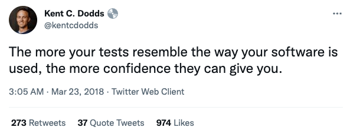

# Introduction

In this workshop...

## What is Jest?

Jest is a JavaScript testing framework and test runner that provides mocking utilities.

## What is React Testing Library (RTL)?

RTL is a set of utilities for DOM manipulation that allows us to test React components.

These utilities encourage testing components the way users interact with them. This makes tests simpler by testing behaviour rather than implementation details.

<https://testing-library.com/>

### RTL common utilities

- `getBy*` and `getAllBy*` - Returns the matching node(s) for a query, and throws an error if no elements match.
- `queryBy*` and `queryAllBy*` - Returns the matching node(s) for a query, and return `null` (or empty array) if no elements match.
- `findBy*` and `findAllBy*` - Returns a `Promise` which resolves when the element(s) for a query is found. The `Promise` is rejected if no element(s) is found.
- `fireEvent` - Methods for firing DOM events (`click`, `focus`, etc.)
- `waitFor` and `waitForElementToBeRemoved` - Methods to wait for an element to appear or disappear in response to an event, user action, timeout, or `Promise`.
